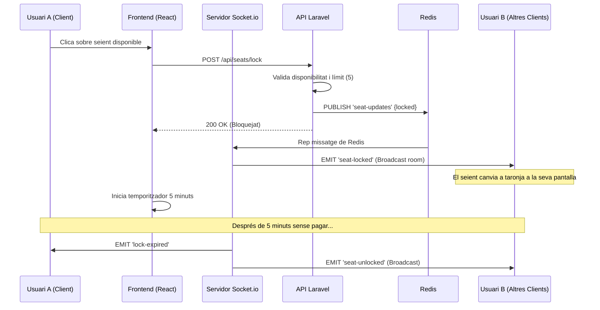
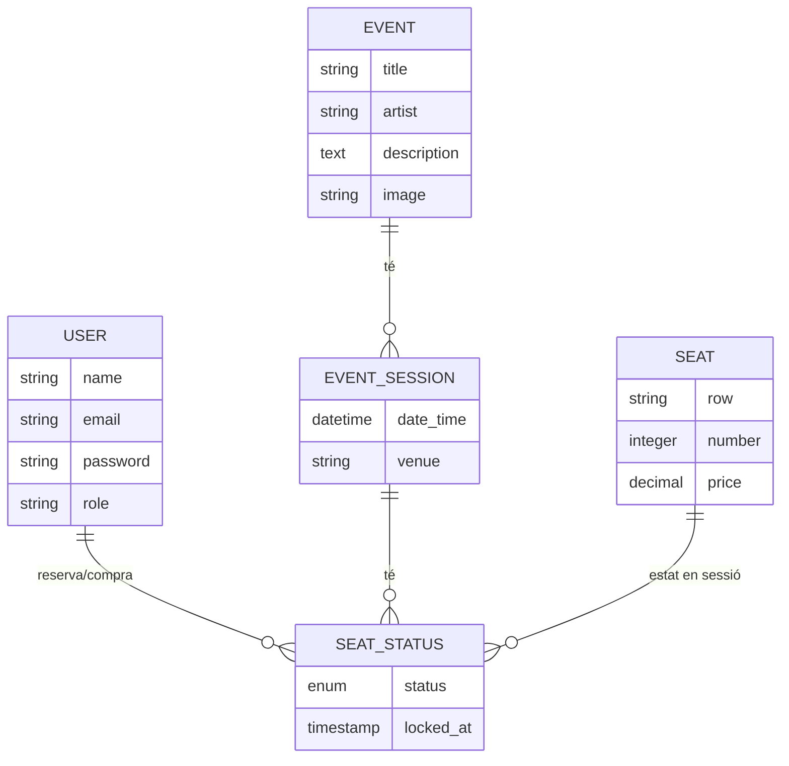

# Diagrames del Projecte - TicketHub

Aquest document conté la representació visual de la lògica del sistema.

## 1. Diagrama de Casos d'Ús
Defineix les accions que poden realitzar els diferents actors del sistema.

```mermaid
useCaseDiagram
    actor Client
    actor Admin
    
    package TicketHub {
        usecase "Iniciar Sessió / Registre" as Login
        usecase "Veure Esdeveniments" as ViewEvents
        usecase "Seleccionar Seients (Real-time)" as SelectSeats
        usecase "Finalitzar Compra" as Checkout
        usecase "Consultar les meves entrades" as MyTickets
        
        usecase "Gestionar Esdeveniments i Sessions" as ManageEvents
        usecase "Gestionar Usuaris" as ManageUsers
        usecase "Consultar Informes de Vendes" as Reports
    }
    
    Client --> Login
    Client --> ViewEvents
    Client --> SelectSeats
    Client --> Checkout
    Client --> MyTickets
    
    Admin --> Login
    Admin --> ManageEvents
    Admin --> ManageUsers
    Admin --> Reports
```

## 2. Diagrama de Seqüència (Reserva amb Sockets)
Mostra la interacció en temps real quan un usuari bloqueja un seient.



## 3. Diagrama Entitat-Relació (ER)
Estructura de la base de dades.


